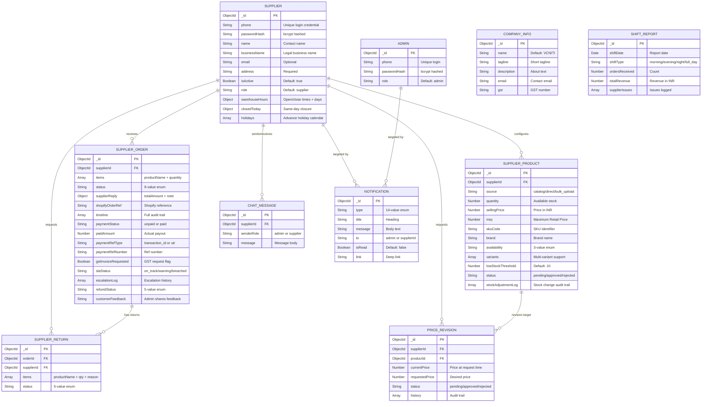
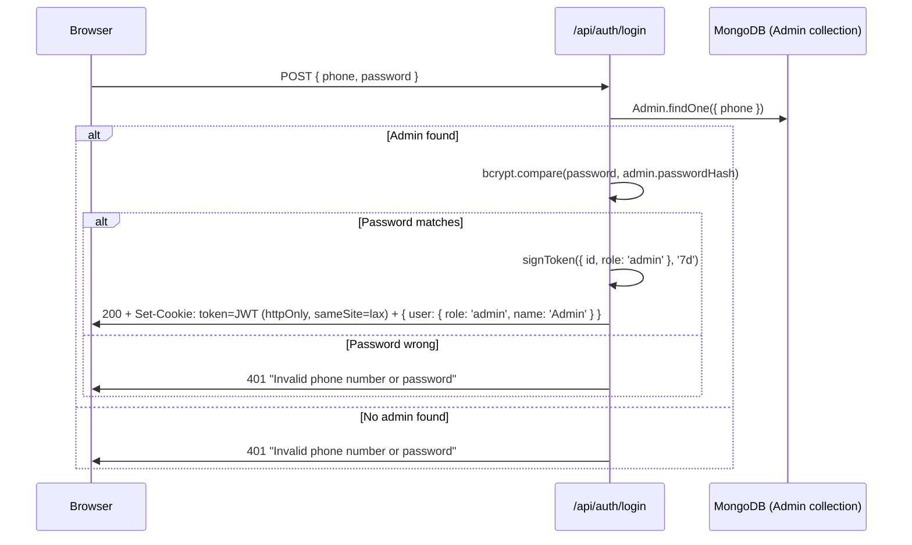
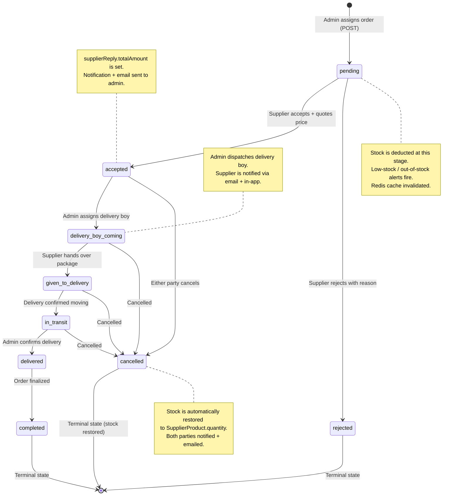
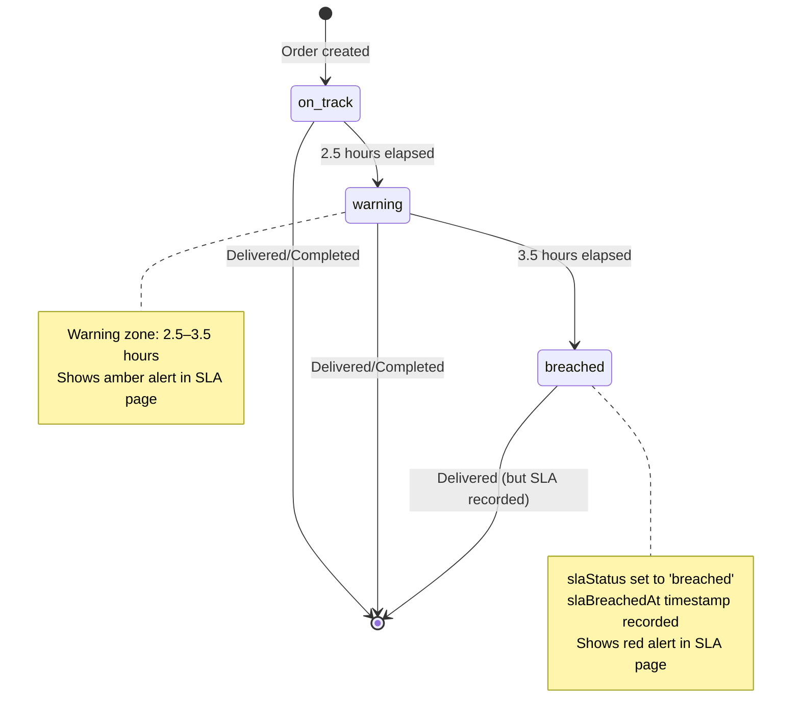
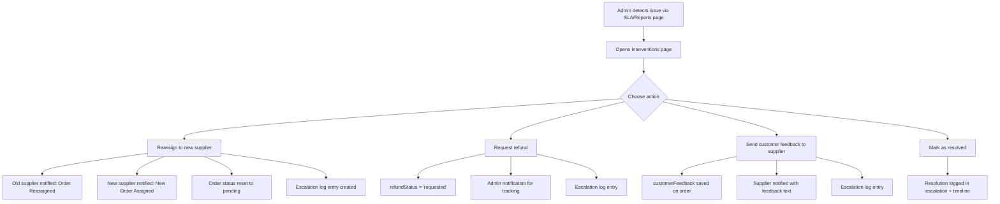

# Admin Dashboard — Complete Technical Manual & Architecture Document

<br/>

> [!IMPORTANT]
> This document serves as the **Master Technical Specification** for the VCNITI Admin Dashboard. Every detail below is derived directly from the actual source code. It covers the full system architecture, every database field, all API endpoints with exact request/response shapes, every UI component with its props and rendering behavior, the security model, the notification engine, email integrations, Shopify connectivity (REST + GraphQL), Firebase user management, Redis caching architecture, bulk upload workflows, SLA monitoring, financial reporting, order interventions, and the precise cause-and-effect of every admin action.

---

## Table of Contents

1. [System Architecture Overview](#1-system-architecture-overview)
2. [Technology Stack & Dependencies](#2-technology-stack--dependencies)
3. [Project Directory Structure](#3-project-directory-structure)
4. [Database Schemas — Complete Field Reference](#4-database-schemas--complete-field-reference)
5. [Authentication & Security Model](#5-authentication--security-model)
6. [Redis Caching Architecture](#6-redis-caching-architecture)
7. [Order Lifecycle State Machine](#7-order-lifecycle-state-machine)
8. [Master API Endpoints Dictionary](#8-master-api-endpoints-dictionary)
9. [Shopify Integration (REST + GraphQL)](#9-shopify-integration-rest--graphql)
10. [Firebase Integration — User Management](#10-firebase-integration--user-management)
11. [Bulk Upload Workflow](#11-bulk-upload-workflow)
12. [SLA Monitoring & Interventions](#12-sla-monitoring--interventions)
13. [UI Component Architecture](#13-ui-component-architecture)
14. [Admin Page Architecture](#14-admin-page-architecture)
15. [Notification Engine](#15-notification-engine)
16. [Email Notification System](#16-email-notification-system)
17. [What Happens When You Do Things](#17-what-happens-when-you-do-things)

---

## 1. System Architecture Overview

The Admin Dashboard is a **full-stack Next.js 16** application dedicated exclusively to the **Admin role**. Unlike the Supplier Dashboard (which serves both roles from a single codebase), this dashboard is admin-only, providing a unified control center for managing suppliers, Shopify storefront orders, supplier orders, products, payments, SLA compliance, interventions, shift reports, finance analytics, and Firebase customer accounts — all from a single interface.

### High-Level Architecture Diagram

```mermaid
graph TD
    subgraph "Client Layer (Browser)"
        A[Admin Login - app/page.tsx] --> B[Admin Dashboard - /admin/*]
        B --> C[22 Admin Pages]
    end

    subgraph "API Layer (35 Next.js Serverless Routes)"
        D["/api/auth/login"]
        D2["/api/auth/me"]
        D3["/api/auth/logout"]
        E["/api/admin/suppliers"]
        E2["/api/admin/suppliers/[id]"]
        F["/api/admin/products"]
        G["/api/admin/manage"]
        H["/api/admin/profile"]
        I["/api/admin/finance"]
        J["/api/admin/interventions"]
        K["/api/admin/sla-alerts"]
        L["/api/admin/shift-reports"]
        M2["/api/supplier-orders"]
        N2["/api/supplier-products"]
        O2["/api/supplier-products/bulk-upload"]
        P2["/api/supplier-products/template"]
        Q2["/api/notifications"]
        R2["/api/supplier-returns"]
        S2["/api/chat"]
        T2["/api/supplier-match"]
        U2["/api/company-info"]
        V2["/api/price-revisions"]
        W2["/api/firebase-users"]
        X2["/api/user-orders"]
        Y2["/api/upload"]
        Z2["/api/seed"]
    end

    subgraph "Shopify API (5 Routes)"
        SA["/api/shopify/analytics"]
        SB["/api/shopify/orders"]
        SC["/api/shopify/orders/[id]"]
        SD["/api/shopify/products"]
        SE["/api/shopify/inventory"]
        SF["/api/shopify/customers"]
    end

    subgraph "Data & Services Layer"
        DB[(MongoDB via Mongoose)]
        REDIS[(Redis via ioredis)]
        AUTH[JWT Auth - lib/auth.ts]
        SHOP[Shopify Admin API - lib/shopifyClient.ts]
        FIRE[Firebase Admin SDK - lib/firebase.ts]
        EMAIL[Nodemailer SMTP - lib/email.ts]
    end

    B --> D & D2 & D3 & E & F & G & H & I & J & K & L & M2 & N2 & O2 & Q2 & R2 & S2 & U2 & V2 & W2 & X2
    B --> SA & SB & SC & SD & SE & SF
    E & F & G & H & I & J & K & L & M2 & N2 & O2 & Q2 & R2 & S2 & U2 & V2 --> DB
    SA & SB & SD & SE & M2 & N2 --> REDIS
    D & D2 --> AUTH
    SA & SB & SC & SD & SE & SF --> SHOP
    W2 & X2 --> FIRE
    M2 & N2 & E --> EMAIL
```



### Data Flow Summary

1. **Browser** → The admin opens the login page (`app/page.tsx`). They enter phone + password.
2. **Login API** (`POST /api/auth/login`) → Checks the `Admin` collection **only** (no Supplier fallback). If matched, verifies password with `bcrypt.compare()`, creates a JWT token via `lib/auth.ts`, sets it as an **httpOnly** cookie (`token`), and returns a user object.
3. **Client** uses a `UserContext` provider that calls `GET /api/auth/me` to verify the session on mount. If invalid, the user is redirected to `/`. The JWT is stored **only** in an httpOnly cookie — **localStorage is NOT used**.
4. **Dashboard pages** call API routes (e.g., `GET /api/shopify/analytics`, `GET /api/supplier-orders`). Each API route reads the JWT from the cookie via `getUserFromRequest(req)` and verifies `role === 'admin'`.
5. **Redis caching** intercepts read requests — if a cached response exists (TTL: 1 hour), it's returned immediately without hitting MongoDB or Shopify. Mutations invalidate relevant cache patterns.
6. **Mutations** (assign order, approve product, etc.) hit `PUT`/`POST`/`PATCH` endpoints which update MongoDB, create `Notification` documents, invalidate Redis cache, and optionally send emails via Nodemailer.

### How This Differs from the Supplier Dashboard

| Aspect | Supplier Dashboard | Admin Dashboard |
|---|---|---|
| **Port** | 3000 (default) | **3001** (custom) |
| **Login** | Checks Admin first, then Supplier | **Admin-only** login (checks `Admin` collection only) |
| **Users** | Suppliers + Admins | **Admins only** |
| **Auth Storage** | localStorage + non-httpOnly cookie | **UserContext + httpOnly cookie** (more secure) |
| **Session Check** | Reads localStorage on mount | Calls `GET /api/auth/me` on mount |
| **Logout** | Clears cookie + localStorage client-side | Calls `POST /api/auth/logout` (server clears cookie) |
| **Middleware** | Protects `/admin/*` and `/supplier/*` | Protects `/admin/*` only |
| **Caching** | No Redis | **Redis via ioredis** — 1-hour TTL on Shopify & dashboard API routes |
| **Shopify** | Limited (product approval pushes) | **Full CRUD** — products, orders, inventory, customers, analytics via GraphQL + REST |
| **Firebase** | Not used | **Firebase Admin SDK** — list/search customer accounts |
| **Unique Routes** | `/api/auth/forgot-password` | `/api/auth/me`, `/api/auth/logout`, `/api/firebase-users`, `/api/user-orders`, `/api/admin/finance`, `/api/admin/interventions`, `/api/admin/sla-alerts`, `/api/admin/shift-reports`, `/api/admin/manage`, `/api/admin/profile`, `/api/shopify/*` (5 routes), `/api/supplier-products/bulk-upload`, `/api/supplier-products/template`, `/api/seed` |
| **Pages** | 12 supplier pages | **22 admin pages** |

---

## 2. Technology Stack & Dependencies

| Layer | Technology | Version | Purpose |
|---|---|---|---|
| **Framework** | Next.js (App Router) | 16.2.0 | Full-stack React framework with serverless API routes |
| **UI Library** | React | 19.2.4 | Component rendering and state management |
| **Language** | TypeScript | 5.9.3 | Type-safe development |
| **Styling** | Tailwind CSS | 3.4.19 | Utility-first CSS framework |
| **Database** | MongoDB (via Mongoose) | 9.3.1 | Document database with ODM |
| **Caching** | Redis (via ioredis) | 5.10.1 | 1-hour TTL caching for Shopify & Dashboard API routes |
| **Authentication** | jsonwebtoken (JWT) | 9.0.3 | Stateless token-based auth with 7-day expiry |
| **Password Hashing** | bcryptjs | 3.0.3 | Password hashing and comparison |
| **HTTP Client** | Axios | 1.13.6 | Shopify Admin API calls (REST + GraphQL) |
| **Firebase** | firebase-admin | 13.7.0 | Firebase Admin SDK for user management |
| **Email** | Nodemailer | 8.0.3 | SMTP email notifications via Gmail |
| **Spreadsheets** | xlsx | 0.18.5 | Excel parsing (bulk upload) + template generation |
| **Archive** | JSZip | 3.10.1 | ZIP file generation for bulk downloads |
| **Env Config** | dotenv | 17.3.1 | Environment variable management |
| **Build Tools** | PostCSS, Autoprefixer, ESLint | Various | CSS processing, browser-compat, code quality |

### Environment Variables Required (`.env.local`)

```
MONGODB_URI=mongodb+srv://...         # MongoDB connection string
JWT_SECRET=...                         # Secret key for JWT signing
SHOPIFY_SHOP_URL=https://....myshopify.com  # Shopify store URL
SHOPIFY_ADMIN_TOKEN=shpat_...          # Shopify Admin API access token
SHOPIFY_API_VERSION=2026-01            # Shopify API version
REDIS_URL=redis://...                  # Redis connection URL (optional — caching disabled if missing)
EMAIL_USER=...@gmail.com               # Gmail address for sending emails
EMAIL_PASS=...                         # Gmail App Password
ADMIN_EMAIL=laxmanrao@vcniti.com       # Admin email for receiving notifications
FIREBASE_SERVICE_ACCOUNT={"type":"service_account",...}  # Firebase service account JSON (inline or file path)
ADMIN_URL=https://admin-dashboard-flame-psi-69.vercel.app  # Admin dashboard deployment URL (for email CTAs)
SUPPLIER_URL=https://supplier-dashboard-zeta.vercel.app    # Supplier dashboard deployment URL (for email CTAs)
```

---

## 3. Project Directory Structure

```
admin-dashboard/
├── app/
│   ├── layout.tsx                     # Root HTML shell, meta title "VCNITI Admin Dashboard"
│   ├── page.tsx                       # Admin login page (phone + password, admin-only)
│   ├── globals.css                    # Global Tailwind imports
│   └── admin/
│       ├── layout.tsx                 # Admin sidebar (22 nav items, collapsible) + TopBar + UserProvider
│       ├── page.tsx                   # Admin overview dashboard (KPIs, charts, tables) — 303 lines
│       ├── users/                     # Firebase customer accounts management
│       ├── suppliers/                 # Supplier CRUD + detail view
│       │   └── [id]/                  # Individual supplier detail page
│       ├── catalog-upload/            # Bulk Excel product upload with Shopify matching
│       ├── products/                  # Shopify product catalog management (GraphQL)
│       ├── submissions/               # Supplier product submission review (approve/reject)
│       ├── product-updates/           # Monitor supplier product changes
│       ├── orders/                    # Shopify storefront orders (with Firebase customer resolution)
│       ├── order-acceptance/          # Supplier order assignment & acceptance tracking
│       ├── order-history/             # Historical supplier order view
│       ├── feedback/                  # Customer feedback management
│       ├── deliveries/                # Delivery tracking & dispatch
│       ├── payments/                  # Supplier payment management
│       ├── gst-requests/              # GST invoice request tracking
│       ├── returns/                   # Supplier return management
│       ├── interventions/             # Order intervention & escalation system
│       ├── sla-alerts/                # SLA breach monitoring
│       ├── shift-reports/             # Daily operations reporting
│       ├── finance/                   # Financial analytics (GMV, payouts, refunds)
│       ├── support/                   # Live chat with suppliers
│       ├── reports/                   # Analytics reports
│       └── settings/                  # Admin profile, password, admin management
│   └── api/
│       ├── auth/
│       │   ├── login/route.ts         # POST — Admin-only login (httpOnly cookie)
│       │   ├── me/route.ts            # GET — Session verification (returns user from JWT)
│       │   └── logout/route.ts        # POST — Clears httpOnly cookie
│       ├── seed/route.ts              # POST — Seed initial admin accounts
│       ├── admin/
│       │   ├── suppliers/route.ts     # GET/POST — Supplier list & create
│       │   ├── suppliers/[id]/route.ts# GET/PUT/DELETE — Single supplier CRUD
│       │   ├── products/route.ts      # GET — Legacy products list
│       │   ├── products/[id]/route.ts # PUT/DELETE — Legacy product update/delete
│       │   ├── manage/route.ts        # GET/POST/DELETE — Admin user management
│       │   ├── profile/route.ts       # GET/PUT — Admin profile & password
│       │   ├── finance/route.ts       # GET — Finance analytics
│       │   ├── interventions/route.ts # GET/POST — Order intervention actions
│       │   ├── sla-alerts/route.ts    # GET — SLA breach & warning detection
│       │   └── shift-reports/route.ts # GET/POST — Shift report CRUD
│       ├── shopify/
│       │   ├── analytics/route.ts     # GET — Computed analytics from Shopify orders (cached)
│       │   ├── orders/route.ts        # GET — List Shopify orders (cached)
│       │   ├── orders/[id]/route.ts   # GET/POST — Order detail + cancel/refund/fulfill
│       │   ├── products/route.ts      # GET/POST/PUT/DELETE — Full Shopify product CRUD (GraphQL, cached)
│       │   ├── inventory/route.ts     # GET/PUT — Inventory levels (GraphQL + REST adjust, cached)
│       │   └── customers/route.ts     # GET — List Shopify customers (cached)
│       ├── firebase-users/route.ts    # GET — List Firebase Auth users
│       ├── user-orders/route.ts       # GET — Shopify orders by customer phone
│       ├── supplier-orders/route.ts   # GET/POST/PUT — Supplier order lifecycle (cached, invalidated on mutation)
│       ├── supplier-products/
│       │   ├── route.ts               # GET/POST/PUT/PATCH — Supplier product CRUD (cached, invalidated on mutation)
│       │   ├── bulk-upload/route.ts   # POST — Excel bulk upload with Shopify matching
│       │   └── template/route.ts      # GET — Download Excel template
│       ├── supplier-returns/route.ts  # GET/POST/PUT — Return management
│       ├── notifications/route.ts     # GET/POST/PUT — Notification CRUD
│       ├── chat/route.ts              # GET/POST — Chat messages
│       ├── supplier-match/route.ts    # POST — Fuzzy product matching
│       ├── company-info/route.ts      # GET/PUT — Company profile
│       ├── price-revisions/route.ts   # GET/POST/PUT — Price revision workflow
│       └── upload/route.ts            # POST — File upload to public/uploads
├── components/
│   ├── AlertsPanel.tsx                # Severity-based alert cards
│   ├── DataTable.tsx                  # Sortable, paginated data grid
│   ├── FilterBar.tsx                  # Dynamic filter controls (text/select/date)
│   ├── KPICard.tsx                    # Color-coded metric cards with icons
│   ├── Modal.tsx                      # Overlay dialog with backdrop blur
│   ├── StatusBadge.tsx                # Color-mapped status pills (22 statuses)
│   ├── StatusTimeline.tsx             # Horizontal step progress tracker
│   ├── SubmissionDetailModal.tsx      # Product submission review modal with Shopify variant diff
│   ├── TabBar.tsx                     # Tabbed navigation with item counts
│   └── TopBar.tsx                     # Global header: search, notifications (tabbed), sound alerts, About VCNITI modal
├── contexts/
│   └── UserContext.tsx                # React Context for auth state (calls /api/auth/me on mount)
├── models/
│   ├── Admin.ts                       # Admin user schema
│   ├── ChatMessage.ts                 # Support chat messages
│   ├── CompanyInfo.ts                 # Company profile (name, GST, tagline)
│   ├── Notification.ts               # System notification documents
│   ├── PriceRevision.ts              # Price revision request workflow
│   ├── Product.ts                     # Legacy product schema
│   ├── ShiftReport.ts                # Daily operations reporting
│   ├── Supplier.ts                    # Supplier user (warehouse hours, holidays)
│   ├── SupplierOrder.ts              # Order lifecycle (SLA, escalation, GST, refunds)
│   ├── SupplierProduct.ts            # Product submissions (variants, MRP, stock log)
│   └── SupplierReturn.ts            # Return request schema
├── lib/
│   ├── auth.ts                        # JWT sign/verify + cookie extraction (Bearer or cookie)
│   ├── db.ts                          # Cached MongoDB connection singleton (global.mongoose)
│   ├── email.ts                       # 9 email template functions via Nodemailer
│   ├── firebase.ts                    # Firebase Admin SDK initialization (singleton, BOM-safe)
│   ├── redis.ts                       # Redis client singleton + cache get/set/invalidate helpers
│   └── shopifyClient.ts             # Axios Shopify client + GID parser (REST + GraphQL)
├── middleware.ts                       # Next.js edge middleware for admin route protection
├── package.json                       # Dependencies and scripts (dev runs on port 3001)
├── tailwind.config.js                 # Tailwind CSS configuration
└── tsconfig.json                      # TypeScript configuration
```

---

## 4. Database Schemas — Complete Field Reference

The Admin Dashboard shares the **same 11 MongoDB collections** as the Supplier Dashboard (same `models/` directory). Below is _every_ field from the actual model files.

### 4.1 `Admin` Collection — `models/Admin.ts`

| Field | Type | Constraints | Purpose |
|---|---|---|---|
| `_id` | ObjectId | Auto-generated PK | Unique identifier |
| `phone` | String | **Required, Unique, Trimmed** | Login credential |
| `passwordHash` | String | **Required** | bcrypt-hashed password |
| `role` | String | Default: `'admin'` | Role for RBAC |
| `createdAt` / `updatedAt` | Date | Auto | Timestamps |

### 4.2 `Supplier` Collection — `models/Supplier.ts`

| Field | Type | Constraints | Purpose |
|---|---|---|---|
| `_id` | ObjectId | Auto-generated PK | Unique identifier |
| `phone` | String | **Required, Unique, Trimmed** | Login credential (phone number) |
| `passwordHash` | String | **Required** | bcrypt-hashed password |
| `name` | String | **Required, Trimmed** | Contact person's name |
| `businessName` | String | **Required, Trimmed** | Legal business name |
| `email` | String | Trimmed | Optional email for notifications |
| `address` | String | **Required** | Physical address |
| `city` | String | Optional | City |
| `state` | String | Optional | State |
| `pincode` | String | Optional | Postal code |
| `isActive` | Boolean | Default: `true` | Account activation flag — if `false`, login is rejected with HTTP 403 on supplier dashboard |
| `role` | String | Default: `'supplier'` | Used in JWT payload for RBAC |
| `warehouseHours` | Embedded Object | | Warehouse operating schedule |
| `warehouseHours.openTime` | String | Default: `'09:00'` | Opening time (HH:MM) |
| `warehouseHours.closeTime` | String | Default: `'18:00'` | Closing time (HH:MM) |
| `warehouseHours.daysOfWeek` | Array of Number | Default: `[1,2,3,4,5,6]` | Active days (0=Sun, 1=Mon...6=Sat) |
| `closedToday` | Embedded Object | | Same-day closure override |
| `closedToday.isClosed` | Boolean | Default: `false` | Whether supplier is closed today |
| `closedToday.reason` | String | Default: `''` | Reason for closure |
| `closedToday.closedAt` | Date | | When closure was set |
| `holidays` | Array of `{ date: Date (required), reason: String }` | | Advance holiday calendar |
| `createdAt` | Date | Auto (timestamps) | Account creation time |
| `updatedAt` | Date | Auto (timestamps) | Last modification time |

### 4.3 `SupplierOrder` Collection — `models/SupplierOrder.ts`

**Indexes**: `{ supplierId: 1, status: 1 }`, `{ shopifyOrderRef: 1, supplierId: 1 }`, `{ slaStatus: 1 }`

| Field | Type | Constraints | Purpose |
|---|---|---|---|
| `_id` | ObjectId | PK | Unique order identifier |
| `supplierId` | ObjectId | **Required**, ref → `Supplier` | Foreign key linking order to supplier |
| `supplierName` | String | Optional | Cached supplier name for display |
| `items` | Array of `{ productName: String (required), quantity: Number (required, min: 1) }` | | Ordered products |
| `status` | String | Enum: `pending`, `accepted`, `rejected`, `cancelled`, `delivery_boy_coming`, `given_to_delivery`, `in_transit`, `delivered`, `completed` — Default: `'pending'` | Current order state |
| `supplierReply` | Embedded Object | | Supplier's response |
| `supplierReply.totalAmount` | Number | | Quoted price by supplier |
| `supplierReply.note` | String | | Optional message from supplier |
| `shopifyOrderRef` | String | | Shopify order reference number |
| `deliveryBoyName` | String | | Assigned delivery person's name |
| `deliveryBoyPhone` | String | | Delivery person's phone number |
| `timeline` | Array of `{ status: String, changedBy: String, timestamp: Date (default: now), note: String }` | | Full audit trail of every status change |
| `paymentStatus` | String | Enum: `'unpaid'`, `'paid'` — Default: `'unpaid'` | Payment tracking |
| `paidAt` | Date | | When payment was processed |
| `paidAmount` | Number | | Actual amount paid |
| `paymentRefType` | String | Enum: `'transaction_id'`, `'utr'` — Default: `'transaction_id'` | Payment reference type |
| `paymentRefNumber` | String | | Transaction ID or UTR number |
| `gstInvoiceRequested` | Boolean | | Whether supplier requested GST invoice |
| `gstInvoiceRequestedAt` | Date | | When GST invoice was requested |
| `gstInvoiceSent` | Boolean | Default: `false` | Whether GST invoice has been sent |
| `gstInvoiceSentAt` | Date | | When GST invoice was sent |
| `slaStatus` | String | Enum: `'on_track'`, `'warning'`, `'breached'` — Default: `'on_track'` | SLA compliance tracking |
| `slaBreachedAt` | Date | | When SLA was breached |
| `confirmedAt` | Date | | When order was confirmed |
| `escalationLog` | Array of `{ action: String (enum), reason: String, performedBy: String, previousSupplierId: ObjectId, newSupplierId: ObjectId, timestamp: Date }` | | Escalation history with actions: `reassign_supplier`, `redispatch_fleet`, `call_customer`, `call_supplier`, `mark_resolved` |
| `refundStatus` | String | Enum: `'none'`, `'requested'`, `'initiated'`, `'processed'`, `'failed'` — Default: `'none'` | Refund lifecycle tracking |
| `refundAmount` | Number | | Amount to refund |
| `refundedAt` | Date | | When refund was processed |
| `refundNote` | String | | Notes on refund |
| `customerFeedback` | String | | Customer feedback shared by admin with supplier |
| `assignedAt` | Date | Default: `Date.now` | When order was assigned to supplier |
| `respondedAt` | Date | | When supplier accepted/rejected |
| `deliveryUpdatedAt` | Date | | When delivery info was last changed |
| `deliveredAt` | Date | | When marked as delivered |
| `cancelledAt` | Date | | When cancelled |
| `cancelReason` | String | | Reason for cancellation |
| `rejectReason` | String | | Reason for rejection |
| `createdAt` / `updatedAt` | Date | Auto | Mongoose timestamps |

### 4.4 `SupplierProduct` Collection — `models/SupplierProduct.ts`

**Indexes**: `{ supplierId: 1, status: 1 }`, `{ skuCode: 1, supplierId: 1 }`

| Field | Type | Constraints | Purpose |
|---|---|---|---|
| `_id` | ObjectId | PK | Unique product ID |
| `supplierId` | ObjectId | **Required**, ref → `Supplier` | Owning supplier |
| `supplierName` | String | | Cached supplier name |
| `source` | String | Enum: `'catalog'`, `'direct'`, `'bulk_upload'` — Default: `'catalog'` | How the product was added |
| `shopifyProductId` | String | | Shopify product ID (for catalog source) |
| `shopifyTitle` | String | | Shopify product title (for catalog source) |
| `shopifyImage` | String | | Shopify product image URL (for catalog source) |
| `productName` | String | | Custom product name (for direct source) |
| `productDescription` | String | | Custom description (for direct source) |
| `productImages` | Array of Strings | | Custom image URLs (for direct source) |
| `productCategory` | String | | Custom category (for direct source) |
| `productUnit` | String | | Unit of measurement (for direct source) |
| `skuCode` | String | Trimmed | SKU code for identification |
| `brand` | String | Trimmed | Brand/vendor name |
| `availability` | String | Enum: `'available'`, `'unavailable'`, `'out_of_stock'` — Default: `'available'` | Real-time availability toggle |
| `quantity` | Number | **Required**, min: 0 | Available inventory stock |
| `sellingPrice` | Number | **Required**, min: 0 | Supplier's selling price (₹) |
| `mrp` | Number | min: 0 | Maximum Retail Price (₹) |
| `variants` | Array of `{ variantId: String, title: String, sku: String, shopifyPrice: String, color: String, quantity: Number, sellingPrice: Number, mrp: Number }` | | Multi-variant support with per-variant pricing, stock, and MRP |
| `lowStockThreshold` | Number | Default: `10` | Threshold for low-stock alerts |
| `status` | String | Enum: `'pending'`, `'approved'`, `'rejected'` — Default: `'pending'` | Admin review status |
| `stockAdjustmentLog` | Array of `{ reason: String (enum), note: String, previousQty: Number, newQty: Number, adjustedBy: String, timestamp: Date }` | | Audit trail for stock changes. Reasons: `new_stock_received`, `correction`, `damaged`, `returned`, `order_fulfilled`, `other` |
| `createdAt` / `updatedAt` | Date | Auto | Timestamps |

### 4.5 `Notification` Collection — `models/Notification.ts`

**Index**: `{ to: 1, isRead: 1, createdAt: -1 }`

| Field | Type | Constraints | Purpose |
|---|---|---|---|
| `_id` | ObjectId | PK | Unique notification ID |
| `type` | String | **Required**, Enum: `product_request`, `product_update`, `price_update`, `quantity_update`, `low_stock`, `password_change`, `support_message`, `order_response`, `order_cancelled`, `return_action`, `dispatch_action`, `order_assigned`, `payment_update`, `return_request` | Notification category |
| `title` | String | **Required** | Short heading text |
| `message` | String | **Required** | Detailed notification message |
| `data` | Mixed | | Arbitrary extra data (orderId, productId, etc.) |
| `from` | ObjectId | ref → `Supplier` | Who triggered this notification |
| `fromName` | String | | Display name of sender |
| `to` | String | Default: `'admin'` | Recipient — either `'admin'` or a supplier's ObjectId string |
| `isRead` | Boolean | Default: `false` | Read/unread status |
| `link` | String | Default: `''` | Deep link to navigate when clicked |
| `createdAt` / `updatedAt` | Date | Auto | Timestamps |

### 4.6 `SupplierReturn` Collection — `models/SupplierReturn.ts`

**Indexes**: `{ supplierId: 1, status: 1 }`, `{ orderId: 1 }`

| Field | Type | Constraints | Purpose |
|---|---|---|---|
| `_id` | ObjectId | PK | Unique return ID |
| `orderId` | ObjectId | **Required**, ref → `SupplierOrder` | Parent order reference |
| `supplierId` | ObjectId | **Required**, ref → `Supplier` | Requesting supplier |
| `supplierName` | String | | Cached supplier name |
| `items` | Array of `{ productName: String (required), quantity: Number (required, min: 1), reason: String }` | | Items being returned |
| `reason` | String | **Required** | Overall return reason |
| `status` | String | Enum: `'requested'`, `'approved'`, `'picked_up'`, `'refunded'`, `'disputed'` — Default: `'requested'` | Return progress |
| `adminNote` | String | | Admin's response note |
| `supplierNote` | String | | Supplier's additional note |
| `shopifyOrderRef` | String | | Shopify order reference |
| `createdAt` / `updatedAt` | Date | Auto | Timestamps |

### 4.7 `ChatMessage` Collection — `models/ChatMessage.ts`

**Index**: `{ supplierId: 1, createdAt: 1 }`

| Field | Type | Constraints | Purpose |
|---|---|---|---|
| `_id` | ObjectId | PK | Message ID |
| `supplierId` | ObjectId | **Required**, ref → `Supplier` | Chat thread identifier |
| `senderRole` | String | **Required**, Enum: `'admin'`, `'supplier'` | Who sent it |
| `message` | String | **Required, Trimmed** | Message body |
| `createdAt` / `updatedAt` | Date | Auto | Timestamps |

### 4.8 `Product` Collection — `models/Product.ts`

**Index**: `{ supplier: 1 }`

| Field | Type | Constraints | Purpose |
|---|---|---|---|
| `_id` | ObjectId | PK | Product ID |
| `name` | String | **Required, Trimmed** | Product name |
| `description` | String | Trimmed | Product description |
| `images` | Array of Strings | | Image URLs |
| `price` | Number | **Required**, min: 0 | Price (₹) |
| `stock` | Number | **Required**, min: 0 | Available stock |
| `unit` | String | Default: `'pcs'` | Unit of measurement |
| `category` | String | | Product category |
| `supplier` | ObjectId | **Required**, ref → `Supplier` | Owning supplier |
| `isAvailable` | Boolean | Default: `true` | Availability toggle |
| `lastUpdated` | Date | Default: `Date.now` | Last update timestamp |

### 4.9 `CompanyInfo` Collection — `models/CompanyInfo.ts`

| Field | Type | Constraints | Purpose |
|---|---|---|---|
| `_id` | ObjectId | PK | Unique record ID |
| `name` | String | Default: `'VCNITI'` | Company name |
| `description` | String | Default: `''` | Company description |
| `email` | String | Default: `''` | Contact email |
| `phone` | String | Default: `''` | Contact phone |
| `website` | String | Default: `''` | Website URL |
| `address` | String | Default: `''` | Physical address |
| `gst` | String | Default: `''` | GST registration number |
| `logo` | String | Default: `''` | Logo URL |
| `tagline` | String | Default: `''` | Company tagline |
| `createdAt` / `updatedAt` | Date | Auto | Timestamps |

### 4.10 `PriceRevision` Collection — `models/PriceRevision.ts`

**Indexes**: `{ supplierId: 1, status: 1 }`, `{ productId: 1 }`

| Field | Type | Constraints | Purpose |
|---|---|---|---|
| `_id` | ObjectId | PK | Unique revision ID |
| `supplierId` | ObjectId | **Required**, ref → `Supplier` | Requesting supplier |
| `supplierName` | String | | Cached supplier name |
| `productId` | ObjectId | **Required**, ref → `SupplierProduct` | Target product |
| `productName` | String | **Required** | Display name of the product |
| `currentPrice` | Number | **Required** | Price at time of request |
| `requestedPrice` | Number | **Required** | Desired new price |
| `reason` | String | Default: `''` | Justification for change |
| `status` | String | Enum: `'pending'`, `'approved'`, `'rejected'` — Default: `'pending'` | Review status |
| `adminNote` | String | Default: `''` | Admin's response note |
| `reviewedAt` | Date | | When admin reviewed |
| `reviewedBy` | String | | Who reviewed |
| `history` | Array of `{ price: Number, changedAt: Date, changedBy: String, action: String }` | | Audit trail: `requested`, `approved`, `rejected` |
| `createdAt` / `updatedAt` | Date | Auto | Timestamps |

### 4.11 `ShiftReport` Collection — `models/ShiftReport.ts`

**Index**: `{ shiftDate: -1 }`

| Field | Type | Constraints | Purpose |
|---|---|---|---|
| `_id` | ObjectId | PK | Unique report ID |
| `shiftDate` | Date | **Required** | Date of the shift |
| `shiftType` | String | Enum: `'morning'`, `'evening'`, `'night'`, `'full_day'` — Default: `'full_day'` | Shift category |
| `generatedAt` | Date | Default: `Date.now` | When report was generated |
| `ordersReceived` | Number | Default: `0` | Orders received during shift |
| `ordersCompleted` | Number | Default: `0` | Orders completed during shift |
| `ordersRejected` | Number | Default: `0` | Orders rejected during shift |
| `ordersCancelled` | Number | Default: `0` | Orders cancelled during shift |
| `slaBreaches` | Number | Default: `0` | SLA breaches during shift |
| `exceptionsHandled` | Number | Default: `0` | Exceptions handled |
| `totalRevenue` | Number | Default: `0` | Revenue generated (₹) |
| `supplierIssues` | Array of `{ supplierId: ObjectId, supplierName: String, issue: String }` | | Supplier-specific issues logged |
| `summary` | String | Default: `''` | Auto-generated narrative summary |
| `generatedBy` | String | Default: `'system'` | Who generated the report |
| `createdAt` / `updatedAt` | Date | Auto | Timestamps |

### Entity Relationship Diagram



---

## 5. Authentication & Security Model

### 5.1 Login Flow — `POST /api/auth/login` (Admin-Only)

**File**: `app/api/auth/login/route.ts`

**Critical difference from Supplier Dashboard:** This login route checks **only** the `Admin` collection. There is no fallback to `Supplier`.



**Key implementation details:**
- The system checks `Admin` collection **only** — there is NO supplier fallback
- JWT payload: `{ id: admin._id.toString(), role: 'admin' }`
- Token expiry: **7 days** (`'7d'`)
- Cookie settings: `httpOnly: true`, `sameSite: 'lax'`, `path: '/'`, `maxAge: 604800` (7 days in seconds)
- The user object is returned in the response but is **NOT stored in localStorage** — session state is managed server-side via the cookie

### 5.2 Session Verification — `GET /api/auth/me`

**File**: `app/api/auth/me/route.ts`

This admin-exclusive endpoint verifies the current session:
1. Calls `getUserFromRequest(req)` to extract and verify JWT from the httpOnly cookie
2. Checks `decoded.role === 'admin'` → returns 401 if not admin
3. Looks up the admin in MongoDB: `Admin.findById(decoded.id).select('phone role')`
4. Returns `{ user: { id, phone, role: 'admin', name: 'Admin' } }` or 401

### 5.3 Client-Side Auth Guard — `contexts/UserContext.tsx`

The admin dashboard uses a React Context provider (`UserProvider`) that wraps the entire admin layout:

```typescript
// UserProvider on mount:
useEffect(() => {
  fetch('/api/auth/me')
    .then(res => res.ok ? res.json() : null)
    .then(data => {
      if (data?.user) setUser(data.user);
      else router.push('/');  // Redirect to login
    })
    .catch(() => router.push('/'));
}, [router]);
```

**No localStorage is used.** The auth state is entirely server-driven via httpOnly cookies.

### 5.4 Route Protection — `middleware.ts`

```typescript
// Runs on EVERY request matching: / , /admin/*
if (pathname.startsWith('/admin')) {
  if (!token cookie exists) {
    redirect to '/'
  }
}
```

This is a **Next.js Edge Middleware** — it runs at the CDN edge _before_ the page renders. It only checks for cookie _presence_, not validity. JWT verification happens in each API route.

### 5.5 API-Level Auth — `lib/auth.ts`

Every API route calls `getUserFromRequest(req)` which:
1. Checks for `Authorization: Bearer <token>` header first
2. Falls back to parsing the `cookie` header for `token=<value>`
3. Calls `jwt.verify(token, JWT_SECRET)` to decode and validate
4. Returns the payload `{ id, role }` or `null` if invalid/expired

### 5.6 Logout Process — `POST /api/auth/logout`

**File**: `app/api/auth/logout/route.ts`

```typescript
// Server-side cookie clearing:
export async function POST() {
  const response = NextResponse.json({ message: 'Logged out' });
  response.cookies.set({ name: 'token', value: '', httpOnly: true, sameSite: 'lax', path: '/', maxAge: 0 });
  return response;
}
```

The `UserContext` logout function:
```typescript
const logout = useCallback(async () => {
  await fetch('/api/auth/logout', { method: 'POST' });  // Server clears cookie
  setUser(null);
  router.push('/');
}, [router]);
```

### 5.7 Admin Self-Service

- **Change password**: `PUT /api/admin/profile` — requires `currentPassword` verification via `bcrypt.compare()`, new password min 6 chars
- **Change phone**: `PUT /api/admin/profile` — checks for phone uniqueness across Admin collection
- **Add new admin**: `POST /api/admin/manage` — min 6 char password, unique phone check, returns 409 on duplicate
- **Remove admin**: `DELETE /api/admin/manage` — cannot delete self (`adminId === user.id` → 400), cannot delete last admin (`countDocuments() <= 1` → 400)

---

## 6. Redis Caching Architecture

**File**: `lib/redis.ts`

The Admin Dashboard implements a **Redis caching layer** using `ioredis` that falls back gracefully when Redis is unavailable.

### Redis Client (Singleton)

```typescript
const client = new Redis(REDIS_URL, {
  maxRetriesPerRequest: 2,
  connectTimeout: 5000,
  lazyConnect: true,
});
```

- **Graceful Degradation**: If `REDIS_URL` is not set or Redis is unreachable, caching is silently skipped — all requests go directly to MongoDB/Shopify
- **Singleton Pattern**: Client is cached in module-level `_client` variable
- **Auto-reconnect**: Uses `lazyConnect: true` with automatic retry on next use

### Cache Helper Functions

| Function | Signature | Purpose |
|---|---|---|
| `getCache<T>(key)` | `async (key: string) → T | null` | Parse and return cached JSON, or null |
| `setCache(key, data, ttl?)` | `async (key: string, data: any, ttl?: number) → void` | Store JSON with TTL (default: 3600s = 1 hour) |
| `invalidateCache(key)` | `async (key: string) → void` | Delete a specific cache key |
| `invalidateCachePattern(pattern)` | `async (pattern: string) → void` | Delete all keys matching a glob pattern using SCAN |

### Predefined Cache Keys

```typescript
CACHE_KEYS = {
  SHOPIFY_ANALYTICS:   'shopify:analytics',
  SHOPIFY_PRODUCTS:    'shopify:products',
  SHOPIFY_INVENTORY:   'shopify:inventory',
  SHOPIFY_ORDERS:      (limit, status) => `shopify:orders:${status}:${limit}`,
  SHOPIFY_CUSTOMERS:   (limit) => `shopify:customers:${limit}`,
  SUPPLIER_ORDERS:     (query) => `supplier-orders:${query}`,
  SUPPLIER_PRODUCTS:   (query) => `supplier-products:${query}`,
  DASHBOARD_OVERVIEW:  'dashboard:overview',
}
```

### Cache Strategy per Route

| Route | Cache Key | TTL | Invalidation Trigger |
|---|---|---|---|
| `GET /api/shopify/analytics` | `shopify:analytics` | 1 hour | — |
| `GET /api/shopify/products` | `shopify:products` | 1 hour | Product mutations |
| `GET /api/shopify/inventory` | `shopify:inventory` | 1 hour | Inventory adjustments |
| `GET /api/shopify/orders` | `shopify:orders:{status}:{limit}` | 1 hour | — |
| `GET /api/shopify/customers` | `shopify:customers:{limit}` | 1 hour | — |
| `GET /api/supplier-orders` | `supplier-orders:{queryString}` | 1 hour | `POST`/`PUT` supplier-orders → `invalidateCachePattern('supplier-orders:*')` |
| `GET /api/supplier-products` | `supplier-products:{queryString}` | 1 hour | `POST`/`PUT`/`PATCH` supplier-products → `invalidateCachePattern('supplier-products:*')` |

---

## 7. Order Lifecycle State Machine

The order status follows a strict state machine enforced by the `PUT /api/supplier-orders` endpoint. Every transition creates a `timeline` entry with the actor and timestamp, and invalidates the Redis `supplier-orders:*` cache pattern.



### Every Transition — What Exactly Happens

| From → To | Trigger | Body Required | Side Effects |
|---|---|---|---|
| `*` → `pending` | Admin POST | `{ supplierId, items[], shopifyOrderRef }` | Stock deducted via `fuzzyMatch()`, low-stock alerts created, notification sent to supplier, **email sent to supplier**, Redis cache invalidated |
| `pending` → `accepted` | Supplier PUT | `{ orderId, action: 'accept', totalAmount, note }` | `supplierReply` saved, `respondedAt` set, notification + timeline entry with items summary, **email with items details sent to admin**, cache invalidated |
| `pending` → `rejected` | Supplier PUT | `{ orderId, action: 'reject', reason }` | `respondedAt` set, `rejectReason` saved, notification + timeline entry with items summary, **email sent to admin**, cache invalidated |
| `accepted` → `delivery_boy_coming` | Admin PUT | `{ orderId, action: 'delivery_boy_coming', deliveryBoyName?, deliveryBoyPhone? }` | Status set, `deliveryUpdatedAt` set, delivery boy info saved, **notification + email sent to supplier**, cache invalidated |
| `delivery_boy_coming` → `given_to_delivery` | Supplier PUT | `{ orderId, action: 'given_to_delivery' }` | `deliveryUpdatedAt` set, notification to admin + timeline, cache invalidated |
| `*` → `in_transit` | System PUT | `{ orderId, action: 'in_transit' }` | `deliveryUpdatedAt` set, notification + timeline, cache invalidated |
| `*` → `delivered` | Admin PUT | `{ orderId, action: 'delivered' }` | `deliveredAt` set, notification to supplier + timeline, **email to supplier**, cache invalidated |
| `*` → `completed` | Admin PUT | `{ orderId, action: 'complete' }` | Timeline entry only, cache invalidated |
| `*` → `cancelled` | Either PUT | `{ orderId, action: 'cancel', reason? }` | **Stock restored** via `fuzzyMatch()`, `cancelledAt` + `cancelReason` set, notifications to both parties, **emails to both parties**, cache invalidated |
| `*` → `paid` | Admin PUT | `{ orderId, action: 'mark_paid', paidAmount?, paymentRefType?, paymentRefNumber? }` | `paymentStatus` = `'paid'`, `paidAt` set, `paidAmount` defaults to `supplierReply.totalAmount`, **payment ref saved**, notification + **email to supplier**, cache invalidated |
| **GST request** | Supplier PUT | `{ orderId, action: 'request_gst_invoice' }` | `gstInvoiceRequested` + `gstInvoiceRequestedAt` set via native MongoDB update, notification + email to admin, cache invalidated |
| **GST sent** | Admin PUT | `{ orderId, action: 'mark_gst_sent' }` | `gstInvoiceSent` + `gstInvoiceSentAt` set, timeline entry, cache invalidated |

### The `fuzzyMatch()` Algorithm

```typescript
function fuzzyMatch(itemName: string, productName: string): boolean {
  const a = itemName.toLowerCase().trim();
  const b = productName.toLowerCase().trim();
  // Direct substring match
  if (a.includes(b) || b.includes(a)) return true;
  // Word-level fuzzy: any word (>2 chars) from item name matches any word in product name
  return a.split(/\s+/).filter(w => w.length > 2).some(w =>
    b.split(/\s+/).some(pw => pw.includes(w) || w.includes(pw))
  );
}
```

---

## 8. Master API Endpoints Dictionary

### 8.1 Authentication

#### `POST /api/auth/login`
Admin-only login. Checks `Admin` collection only. Returns JWT token in httpOnly cookie + user object.

| Property | Value |
|---|---|
| **Request Body** | `{ phone: string, password: string }` |
| **Success Response** | `200 { message, user: { id, phone, role: 'admin', name: 'Admin' } }` + `Set-Cookie: token=<JWT> (httpOnly)` |
| **Error Responses** | `400` (missing fields), `401` (invalid credentials), `500` (server error) |

#### `GET /api/auth/me`
Session verification. Extracts JWT from httpOnly cookie, verifies admin role, returns user object.

| Property | Value |
|---|---|
| **Auth Required** | Yes (admin only) |
| **Success Response** | `200 { user: { id, phone, role: 'admin', name: 'Admin' } }` |
| **Error Response** | `401 { user: null }` if invalid/missing token or not admin |

#### `POST /api/auth/logout`
Clears the httpOnly token cookie.

| Property | Value |
|---|---|
| **Auth Required** | No (idempotent) |
| **Response** | `200 { message: 'Logged out' }` + `Set-Cookie: token= (maxAge=0)` |

#### `POST /api/seed`
Idempotent seed route. Creates 2 default admin accounts if `Admin.countDocuments() === 0`.

---

### 8.2 Admin Management (`/api/admin/*`)

#### `GET/POST/DELETE /api/admin/manage`

| Method | Purpose | Body / Params | Validations |
|---|---|---|---|
| `GET` | List all admins (phone, role, createdAt) | None | Admin-only |
| `POST` | Create new admin | `{ phone, password }` | Min 6 chars, unique phone (409 on duplicate) |
| `DELETE` | Remove an admin | `?id=adminId` | Cannot delete self (400), cannot delete last admin (400), 404 if not found |

#### `GET/PUT /api/admin/profile`

| Method | Purpose | Body | Validations |
|---|---|---|---|
| `GET` | Get current admin's profile (phone, role, createdAt) | None | Admin-only |
| `PUT` | Update phone or password | `{ phone?, currentPassword?, newPassword? }` | Current password verified via bcrypt, new password min 6 chars, phone uniqueness check (409 on duplicate) |

---

### 8.3 Supplier Management (`/api/admin/suppliers/*`)

#### `GET/POST /api/admin/suppliers`

| Method | Purpose | Body |
|---|---|---|
| `GET` | List all suppliers (excludes passwordHash). Sorted by `createdAt` descending | None |
| `POST` | Create new supplier | `{ phone, password, name, businessName, address, email?, city?, state?, pincode? }` — unique phone check (400) |

#### `GET/PUT/DELETE /api/admin/suppliers/[id]`

| Method | Purpose | Body | Side Effects |
|---|---|---|---|
| `GET` | Get single supplier | None | None |
| `PUT` | Update supplier | All fields optional; `password` triggers re-hash | **Email to supplier** if password or profile changed |
| `DELETE` | Delete supplier | None | Permanent removal |

---

### 8.4 Shopify Integration Routes (`/api/shopify/*`) — **Admin Dashboard Exclusive**

#### `GET /api/shopify/analytics`

**Purpose**: Compute real-time analytics from Shopify orders. **Cached in Redis for 1 hour.**

**Data Fetched**: Last 250 Shopify orders + product count + customer count (3 parallel API calls).

**Response**:
```json
{
  "kpis": {
    "totalOrders": 150,
    "todaysOrders": 5,
    "pendingOrders": 12,           // fulfillment=null, financial=paid
    "fulfilledOrders": 98,
    "cancelledOrders": 8,
    "refundedOrders": 3,
    "codOrders": 45,               // gateway=cash_on_delivery or tag=COD
    "paidOrders": 120,
    "totalRevenue": 450000,
    "todaysRevenue": 15000,
    "weeklyRevenue": 85000,
    "monthlyRevenue": 250000,
    "productCount": 65,
    "customerCount": 230
  },
  "topProducts": [
    { "title": "TMT Steel 12mm", "qty": 50, "revenue": 325000 }
  ],
  "dailyRevenue": [
    { "date": "2026-04-03", "revenue": 12000, "orders": 3 }
  ]
}
```

#### `GET /api/shopify/orders`

| Param | Default | Purpose |
|---|---|---|
| `status` | `any` | Shopify order status filter |
| `limit` | `50` | Max orders to return |

**Cached** with key `shopify:orders:{status}:{limit}`.

#### `GET/POST /api/shopify/orders/[id]`

| Method | Purpose |
|---|---|
| `GET` | Fetch single order with line item images (enriched via product lookup) |
| `POST` | Order actions: `cancel`, `refund`, `fulfill` |

**Cancel** action: `{ action: 'cancel', reason?: string, notify?: boolean }`
**Refund** action: `{ action: 'refund', note?: string, notify?: boolean }` — auto-calculates refund via `refunds/calculate.json`
**Fulfill** action: `{ action: 'fulfill', tracking?: { number, company, url }, notify?: boolean }` — finds open fulfillment order, creates fulfillment

#### `GET/POST/PUT/DELETE /api/shopify/products`

**GET**: Fetches up to **500 products via Shopify GraphQL API** with cursor-based pagination. **Cached.** Returns:
- Product details: id, title, handle, status, vendor, type, tags, inventory
- Variants: id, price, compare_at_price, sku, inventory, selectedOptions
- Images: first 5 images (max 500px width)

**POST**: Creates **draft** Shopify product. Always `status: 'draft'`. Supports variants, options, images.

**PUT**: Updates Shopify product. **Cannot set status to 'active'** — forced to draft for safety.

**DELETE**: Removes Shopify product by ID.

#### `GET/PUT /api/shopify/inventory`

**GET**: Fetches 100 product variants via GraphQL with inventory quantities, tracking status, and product images. **Cached.**

**Response stats**: `{ totalItems, lowStock (≤10), outOfStock (≤0), inStock (>0) }`

**PUT**: Adjusts inventory levels. Auto-resolves default location if `location_id` not provided.
```json
{ "inventory_item_id": "...", "available_adjustment": 10, "location_id?": "..." }
```

#### `GET /api/shopify/customers`

Lists Shopify customers. Default limit: 50. **Cached.**

---

### 8.5 Firebase Routes — **Admin Dashboard Exclusive**

#### `GET /api/firebase-users`

Lists Firebase Auth users (admin-only).

| Param | Default | Purpose |
|---|---|---|
| `limit` | `1000` | Max users to return |
| `nextPageToken` | — | Pagination token |

**Response per user**:
```json
{
  "uid": "abc123",
  "phone": "+919876543210",
  "email": "user@example.com",
  "displayName": "John Doe",
  "photoURL": null,
  "disabled": false,
  "emailVerified": false,
  "createdAt": "Mon, 01 Jan 2026 00:00:00 GMT",
  "lastSignIn": "Wed, 09 Apr 2026 10:00:00 GMT",
  "providerId": "phone"
}
```

#### `GET /api/user-orders`

Fetches **Shopify orders for a specific customer** by phone number.

| Param | Required | Purpose |
|---|---|---|
| `phone` | Yes | Customer phone to search |

**Flow**:
1. Searches Shopify customers by phone: `GET /customers/search.json?query=phone:...`
2. Fetches their orders: `GET /orders.json?customer_id=...&status=any&limit=50`
3. Returns customer profile + enriched order list

---

### 8.6 Supplier Order Lifecycle (`/api/supplier-orders`)

**GET** is cached in Redis. **POST** and **PUT** invalidate the cache pattern `supplier-orders:*`.

| Admin Action | Method + Body | Effect |
|---|---|---|
| Assign order | `POST { supplierId, items[], shopifyOrderRef? }` | Creates order, deducts stock, notifies + emails supplier, invalidates cache |
| Dispatch delivery boy | `PUT { orderId, action: 'delivery_boy_coming', deliveryBoyName?, deliveryBoyPhone? }` | Updates status, notifies + emails supplier, invalidates cache |
| Mark delivered | `PUT { orderId, action: 'delivered' }` | Sets `deliveredAt`, notifies + emails supplier, invalidates cache |
| Complete order | `PUT { orderId, action: 'complete' }` | Final state, invalidates cache |
| Cancel order | `PUT { orderId, action: 'cancel', reason? }` | **Restores stock**, notifies + emails both parties, invalidates cache |
| Mark paid | `PUT { orderId, action: 'mark_paid', paidAmount?, paymentRefType?, paymentRefNumber? }` | Payment recorded, emails supplier, invalidates cache |
| Mark GST sent | `PUT { orderId, action: 'mark_gst_sent' }` | Sets `gstInvoiceSent`, invalidates cache |

---

### 8.7 Supplier Product Management (`/api/supplier-products/*`)

#### `PUT /api/supplier-products` — Admin Approve/Reject

| Action | Effect |
|---|---|
| `approve` (catalog source) | Sets `status: 'approved'`, notifies + **emails** supplier |
| `approve` (direct source) | **Pushes to Shopify** as draft via REST API, sets approved, notifies + emails |
| `reject` | Sets `status: 'rejected'`, notifies + **emails** supplier |

#### `POST /api/supplier-products/bulk-upload` — **Admin Dashboard Exclusive**

See [Section 11: Bulk Upload Workflow](#11-bulk-upload-workflow) for complete details.

#### `GET /api/supplier-products/template` — **Admin Dashboard Exclusive**

Downloads an Excel template (`VCNITI_Product_Upload_Template.xlsx`) with:
- **Products sheet**: 8 columns with 3 sample rows (TMT Steel, Cement, River Sand)
- **Instructions sheet**: Field descriptions with Required/Optional markers

---

### 8.8 Finance Analytics (`/api/admin/finance`) — **Admin Dashboard Exclusive**

Computes supplier workflow financial metrics.

| Param | Options | Purpose |
|---|---|---|
| `period` | `daily` (default), `weekly`, `monthly` | Time filter |
| `startDate` / `endDate` | Date strings | Custom range (overrides period) |

**Response**:
```json
{
  "period": "weekly",
  "startDate": "2026-04-07T00:00:00.000Z",
  "kpis": {
    "totalOrders": 45,
    "completedOrders": 32,
    "gmv": 150000,              // Total quoted on completed orders
    "supplierPayouts": 120000,   // Actual paid amounts
    "pendingPayouts": 30000,     // Unpaid quoted amounts
    "refunds": 5000              // Total refund amounts
  },
  "supplierBreakdown": [
    { "supplierId": "...", "name": "Supplier A", "orders": 12, "amount": 50000, "paid": 40000 }
  ]
}
```

---

### 8.9 Interventions (`/api/admin/interventions`) — **Admin Dashboard Exclusive**

| Method | Purpose |
|---|---|
| `GET` | Fetch all orders with escalation logs (limit 50, sorted by updatedAt desc), or single order's log via `?orderId=` |
| `POST` | Perform intervention action |

**Intervention Actions:**

| Action | Body | Effect |
|---|---|---|
| `reassign_supplier` | `{ orderId, action, newSupplierId, reason? }` | Changes `supplierId`, resets status to `pending`, notifies old supplier ("Order Reassigned"), notifies new supplier ("New Order Assigned"), logs escalation, adds timeline entry |
| `request_refund` | `{ orderId, action, reason? }` | Sets `refundStatus: 'requested'`, saves `refundNote`, creates escalation log, timeline entry "Refund requested", notifies admin for tracking |
| `send_customer_feedback` | `{ orderId, action, feedback }` | Sets `customerFeedback`, notifies supplier with feedback text, timeline entry, logs escalation |
| `mark_resolved` | `{ orderId, action, reason? }` | Logs resolution in escalation log and timeline |

---

### 8.10 SLA Alerts (`/api/admin/sla-alerts`) — **Admin Dashboard Exclusive**

**SLA Threshold**: **3.5 hours** (configurable via `SLA_THRESHOLD_HOURS` constant)

**Logic**:
1. Finds all orders created more than 3.5 hours ago that are still in active status (`pending`, `accepted`, `delivery_boy_coming`, `given_to_delivery`, `in_transit`)
2. Auto-updates their `slaStatus` to `'breached'` and sets `slaBreachedAt` via batch update
3. Also finds warning orders (2.5–3.5 hours old)
4. Enriches each order with `elapsedMinutes`, `elapsedHours`, and `severity` ('breached' or 'warning')

**Response**: `{ breached: [], warning: [], totalBreached, totalWarning, thresholdHours: 3.5 }`

---

### 8.11 Shift Reports (`/api/admin/shift-reports`) — **Admin Dashboard Exclusive**

| Method | Purpose |
|---|---|
| `GET` | Fetch reports. Optional `?date=YYYY-MM-DD` filter. Max 30 reports. |
| `POST` | Auto-generate report for today. Body: `{ shiftType? }` |

**Auto-Generation Logic (POST)**:
1. Queries all `SupplierOrder` documents created today
2. Counts: received, completed, rejected, cancelled, SLA breached
3. Calculates revenue from delivered/completed orders
4. Identifies supplier issues: suppliers with ≥2 rejections today
5. Generates narrative summary (e.g., "15 orders received, 10 completed, 2 rejected, 1 cancelled. 0 SLA breaches. Revenue: ₹1,50,000.")
6. Saves `ShiftReport` document with `generatedBy: 'Admin'`

---

## 9. Shopify Integration (REST + GraphQL)

**File**: `lib/shopifyClient.ts`

```typescript
// Singleton Axios client
const client = axios.create({
  baseURL: `${SHOPIFY_SHOP_URL}/admin/api/2026-01`,
  headers: {
    'X-Shopify-Access-Token': SHOPIFY_ADMIN_TOKEN,
    'Content-Type': 'application/json',
  },
});

// GID parser: "gid://shopify/Product/123" → 123
function parseGid(gid: string): number | null;
```

### When GraphQL vs REST is Used

| Use Case | Protocol | Endpoint |
|---|---|---|
| **Product listing** (up to 500) | **GraphQL** | `POST /graphql.json` with cursor pagination |
| **Product CRUD** | **REST** | `POST/PUT/DELETE /products.json` |
| **Inventory listing** | **GraphQL** | `POST /graphql.json` for variant details |
| **Inventory adjustment** | **REST** | `POST /inventory_levels/adjust.json` |
| **Order listing** | **REST** | `GET /orders.json` |
| **Order detail** | **REST** | `GET /orders/{id}.json` |
| **Order actions** | **REST** | `POST /orders/{id}/cancel.json`, `/refunds.json`, `/fulfillments.json` |
| **Customer listing** | **REST** | `GET /customers.json` |
| **Customer search** | **REST** | `GET /customers/search.json?query=phone:...` |
| **Analytics** | **REST** | Multiple `GET` calls aggregated server-side |

### GraphQL Product Query Structure

```graphql
query {
  products(first: 250, sortKey: CREATED_AT, reverse: true, after: "cursor") {
    pageInfo { hasNextPage endCursor }
    edges {
      node {
        id title handle status vendor productType tags createdAt updatedAt
        totalInventory
        options { name values }
        variants(first: 50) {
          edges {
            node {
              id price compareAtPrice sku inventoryQuantity title
              selectedOptions { name value }
            }
          }
        }
        images(first: 5) {
          edges { node { url(transform: {maxWidth: 500}) altText } }
        }
      }
    }
  }
}
```

**Safety constraint**: New products are **always created as `draft`**. The PUT endpoint **cannot set status to `active`** — it is force-downgraded to `draft`.

---

## 10. Firebase Integration — User Management

**File**: `lib/firebase.ts`

### Initialization

The Firebase Admin SDK is initialized as a **singleton** using the `firebase-admin` package:

1. Checks `admin.apps.length` to prevent re-initialization
2. Reads `FIREBASE_SERVICE_ACCOUNT` from environment variables
3. Supports both **inline JSON** (`{...}`) and **file path** formats
4. Handles BOM (byte-order mark) characters in environment variables: `envVar.charCodeAt(0) === 0xFEFF`
5. Initializes with `admin.credential.cert(serviceAccount)`
6. Failure is logged but **does not crash** — customer resolution falls back to Shopify data

### Admin Dashboard Usage

Firebase is used to **list and identify customer accounts** in the VCNITI mobile app:

1. **Users page** (`/admin/users`) fetches all Firebase Auth users via `GET /api/firebase-users`
2. **Dashboard Overview** (`/admin`) fetches Firebase users and builds a phone/UID lookup for customer resolution
3. **Orders page** (`/admin/orders`) resolves Shopify order customers by finding matching Firebase users

### Phone Number Resolution Algorithm

```typescript
// Builds multi-format lookup from Firebase users:
lookup[u.uid] = u;                            // Firebase UID
lookup[u.phone] = u;                          // Raw: +919876543210
lookup[stripped] = u;                          // No prefix: 9876543210
lookup['+91' + stripped] = u;                  // With +91
lookup[digits.slice(-10)] = u;                // Last 10 digits

// Resolves customer from Shopify order:
1. Extract phone from shipping_address → billing_address → customer → order
2. Try Firebase lookup by exact phone → +91 norm → last 10 digits → scan all users
3. Try Firebase UID from order note regex: /Firebase UID:\s*(\S+)/
4. Fallback: Shopify customer name → shipping address name → phone → "Guest"
```

---

## 11. Bulk Upload Workflow

**File**: `app/api/supplier-products/bulk-upload/route.ts`

This is a sophisticated 2-phase bulk product upload system with intelligent Shopify catalog matching.

### Phase 1: Preview (POST with `action: 'preview'`)

```mermaid
flowchart TD
    A[Admin uploads Excel file] --> B[Parse XLSX to JSON rows]
    B --> C{Validate each row}
    C -->|Missing name/SKU/price| D[Add to errors[]]
    C -->|Valid| E[Check for internal duplicates]
    E -->|Duplicate SKU in upload| D
    E -->|Unique| F[Check against existing SupplierProducts]
    F -->|SKU or name exists| G[Add to duplicates[]]
    F -->|New product| H[Fetch ALL Shopify products via GraphQL]
    H --> I[Run 3-tier matching algorithm]
    I -->|Match found| J["Add to existingInCatalog[] (with shopifyMatch)"]
    I -->|No match| K[Add to newProducts[]]
    
    J --> L[Return preview results]
    K --> L
    G --> L
    D --> L
```

### 3-Tier Shopify Matching Algorithm

```
Step 1: EXACT MATCH
  → "TMT Steel Bars 12mm" === shopifyTitle (case-insensitive)
  → If found, done.

Step 2: PROGRESSIVE PREFIX NARROWING (≥2 words)
  → Start with first 2 words: "tmt steel"
  → If >3 matches, add 3rd word: "tmt steel bars"
  → If still >3, add 4th: "tmt steel bars 12mm"
  → Return narrowest set with results

Step 3: KEYWORD FALLBACK (unordered, ≥2 hits needed)
  → Extract significant words (skip: the, and, for, etc.)
  → Count keyword overlap between upload name and each Shopify title
  → Need ≥2 keyword matches
  → Return top results sorted by hit count
```

### Phase 2: Submit (POST with `action: 'submit'`)

| Category | How It's Handled |
|---|---|
| **New products** | Created as `source: 'bulk_upload'`, `status: 'pending'`, with initial `stockAdjustmentLog` entry |
| **Catalog matches** | Created as `source: 'catalog'` with `shopifyProductId` linked, variant mapping from admin selection |
| **Duplicates** | Existing SupplierProducts are **updated** (quantity, price, MRP, brand, category reinstated) with stock log |
| **Errors** | Skipped, reported in response |

After submission, a `product_request` notification is sent to admin: "Bulk Product Upload — X new, Y updated".

### Excel Template Columns

| Column | Required | Example |
|---|---|---|
| Product Name | ✅ | TMT Steel Bars 12mm |
| SKU Code | ✅ | TMT-12-500 |
| Unit | ✅ | tons |
| Brand | ❌ | Tata Tiscon |
| Category | ❌ | Steel |
| Quantity | ✅ | 100 |
| MRP (₹) | ❌ | 65000 |
| Selling Price (₹) | ✅ | 58000 |

---

## 12. SLA Monitoring & Interventions

### SLA Breach Detection

The SLA system operates on a **3.5-hour threshold**:



**Auto-update**: When the SLA Alerts API is called, it automatically batch-updates all breached orders:
```typescript
await SupplierOrder.updateMany(
  { _id: { $in: breachedIds }, slaStatus: { $ne: 'breached' } },
  { $set: { slaStatus: 'breached', slaBreachedAt: new Date() } }
);
```

### Intervention Workflow



---

## 13. UI Component Architecture

Every component uses `'use client'` for client-side interactivity and **Tailwind CSS** for styling. The Admin Dashboard shares the **same 10 reusable components** as the Supplier Dashboard.

### 13.1 `KPICard.tsx` — Metric Display Card

**Props Interface:**

```typescript
interface KPICardProps {
  title: string;          // e.g., "Total Orders", "Revenue"
  value: string | number; // e.g., 42 or "₹15,000"
  icon?: React.ReactNode; // SVG icon element
  trend?: { value: string; positive: boolean }; // e.g., { value: "+12%", positive: true }
  color?: 'blue' | 'emerald' | 'amber' | 'red' | 'purple' | 'indigo'; // Default: 'blue'
  subtitle?: string;      // Small text below the value
}
```

**Color System:** Each color maps to 4 Tailwind class sets:

| Color | Background | Text | Icon BG | Border |
|---|---|---|---|---|
| `blue` | `bg-blue-50` | `text-blue-600` | `bg-blue-100 text-blue-600` | `border-blue-100` |
| `emerald` | `bg-emerald-50` | `text-emerald-600` | `bg-emerald-100 text-emerald-600` | `border-emerald-100` |
| `amber` | `bg-amber-50` | `text-amber-600` | `bg-amber-100 text-amber-600` | `border-amber-100` |
| `red` | `bg-red-50` | `text-red-600` | `bg-red-100 text-red-600` | `border-red-100` |
| `purple` | `bg-purple-50` | `text-purple-600` | `bg-purple-100 text-purple-600` | `border-purple-100` |
| `indigo` | `bg-indigo-50` | `text-indigo-600` | `bg-indigo-100 text-indigo-600` | `border-indigo-100` |

---

### 13.2 `DataTable.tsx` — Sortable Paginated Grid

**Props Interface:**

```typescript
interface DataTableProps {
  columns: Column[];           // Column definitions
  data: any[];                 // Row data array
  loading?: boolean;           // Shows skeleton animation
  emptyMessage?: string;       // Custom empty state text (Default: "No data found.")
  onRowClick?: (row) => void;  // Row click handler
  pageSize?: number;           // Rows per page (Default: 10)
  actions?: (row) => ReactNode; // Action buttons column
}

interface Column {
  key: string;                  // Data field key
  label: string;                // Column header text
  sortable?: boolean;           // Enable click-to-sort
  render?: (value, row) => ReactNode; // Custom cell renderer
  width?: string;               // Fixed width (CSS value)
}
```

**Features:**
- **Client-side sorting**: Click sortable column headers to toggle ascending/descending
- **Client-side pagination**: Slices the sorted array into pages of `pageSize`
- **Loading skeleton**: Renders 5 pulsing rows with gray placeholder bars
- **Empty state**: Shows an inbox icon with configurable message
- **Pagination controls**: "Previous" / page numbers / "Next" (shows up to 5 page buttons)
- **Row hover**: Light gray background on hover (`hover:bg-gray-50/50`)
- **Actions column**: Optional right-aligned column for action buttons

---

### 13.3 `AlertsPanel.tsx` — Alert Triage System

**Props Interface:**

```typescript
interface Alert {
  id: string | number;
  type: 'warning' | 'info' | 'success' | 'error';
  message: string;
  time?: string;
  action?: { label: string; onClick: () => void };
}

interface AlertsPanelProps {
  title?: string;   // Default: "Alerts"
  alerts: Alert[];
}
```

**Alert Type → Color Mapping:**

| Type | Background | Border | Dot Color | Use Case |
|---|---|---|---|---|
| `warning` | `bg-amber-50` | `border-amber-200` | `bg-amber-400` | Pending orders, low stock |
| `info` | `bg-blue-50` | `border-blue-200` | `bg-blue-400` | In-progress, refunded orders |
| `success` | `bg-emerald-50` | `border-emerald-200` | `bg-emerald-400` | Fulfilled orders |
| `error` | `bg-red-50` | `border-red-200` | `bg-red-400` | Cancelled orders, critical issues |

If `alerts.length === 0`, the entire panel is hidden (returns `null`).

---

### 13.4 `StatusBadge.tsx` — Color-Coded Status Pills

**Supports 22 status values** mapped to specific colors:

| Category | Status | Colors |
|---|---|---|
| **Order** | `pending` | Amber |
| | `accepted` | Indigo |
| | `in transit` | Cyan |
| | `delivered` | Emerald |
| | `cancelled`, `failed`, `rejected` | Red |
| **Product** | `active`, `approved`, `in stock`, `paid` | Emerald |
| | `inactive`, `closed` | Gray |
| | `pending`, `in progress`, `low stock` | Amber |
| | `out of stock`, `unpaid`, `escalated` | Red |
| | `new`, `processing`, `open` | Blue |

Unknown statuses fall back to gray (`bg-gray-100 text-gray-600`). Supports `sm` and `md` sizes.

---

### 13.5 `TopBar.tsx` — Global Header with Real-Time Notifications & About Modal

**Features:**
- **VCNITI logo** with blue-to-indigo gradient
- **Global search bar** with magnifying glass icon
- **Notification bell** with unread count badge (red circle, capped at "9+")
- **Tabbed notification dropdown** with **Notifications** (unread) and **History** (read) tabs
- **Audio notification sound** via Web Audio API (three ascending tones: D5, G5, C6)
- **Auto-polling**: Fetches `/api/notifications?limit=50` every **15 seconds** via `setInterval`
- **Sound trigger**: Plays notification tone when `unreadCount` increases between polls
- **"Mark all read"** button that calls `PUT /api/notifications { markAllRead: true, to: 'admin' }`
- **Click navigation**: Clicking a notification marks it read and navigates to its `link` URL
- **Time formatting**: Displays relative time ("Just now", "5m ago", "2h ago", "3d ago")
- **Emoji type icons**: 📦 product_request, 📋 order_response, 🔔 order_assigned, 💬 support_message, 🔑 password_change, 💰 price_update, 📊 quantity_update
- **About VCNITI modal**: Accessible via the "V" profile button. Admin gets an **edit button** to modify all company info fields. Fetches company info from `/api/company-info`. Non-admin users see a read-only view.

---

### 13.6 `SubmissionDetailModal.tsx` — Product Submission Review Modal

**Props Interface:**

```typescript
interface SubmissionDetailModalProps {
  submission: any;             // Product submission object
  onClose: () => void;         // Close handler
  onApprove: (id: string) => void; // Approve callback
  onReject: (id: string) => void;  // Reject callback
  approving: string | null;    // ID of product currently being approved
}
```

**Admin-specific features:**
- **Product header** with status badge and product name
- **Product image** display (or "Uploaded via Excel" placeholder for bulk uploads)
- **Price & quantity** summary (hidden when variants exist)
- **Info grid** showing: supplier name, source type, submission date, status, category, unit, MRP, SKU code, brand, Shopify ID
- **New Variant Detection**: Fetches Shopify product variants via `/api/shopify/products`, compares with submitted variants. Highlights new variants not found in Shopify with amber "NEW" badge and warning alert
- **Variants table** with columns: Variant, Color, MRP, Price, Qty — with totals row
- **Approve/Reject action buttons** (only shown for pending submissions)
- **Multiple image gallery** for products with more than one image

---

### 13.7 Other Components

| Component | Description |
|---|---|
| `FilterBar.tsx` | Supports `text`, `select`, and `date` filter types. Shows "Clear all" when active. |
| `StatusTimeline.tsx` | Horizontal stepper: green circles (completed), blue (active), gray (future) |
| `Modal.tsx` | Overlay dialog with sizes sm/md/lg/xl, backdrop blur, click-outside-close |
| `TabBar.tsx` | Horizontal tab bar with blue bottom border on active + optional count badges |

---

## 14. Admin Page Architecture

### 14.1 Dashboard Overview (`/admin` — `page.tsx`, 303 lines)

**Data Sources**: 4 parallel API calls on mount:
1. `GET /api/shopify/analytics` → KPI cards + charts (cached in Redis)
2. `GET /api/shopify/orders?limit=10` → Recent orders table
3. `GET /api/supplier-orders?limit=500` → Supplier workflow KPIs (cached in Redis)
4. `GET /api/firebase-users` → Customer name resolution via phone lookup

**Layout Sections**:
1. **6 Shopify KPI cards** (clickable → navigate to detail pages): Today's Orders, Weekly Revenue, Customers, Products, Pending Orders, Total Revenue
2. **6 Supplier Workflow KPIs**: Orders Assigned, Pending Response, Active Deliveries, Completed, Total Quoted, Unpaid
3. **3-Column Charts Row**: Top Products (bar chart), Order Status Breakdown (pill-style counts), Daily Revenue (7-day bar chart)
4. **Recent Orders + Alerts**: DataTable with Firebase-resolved customer names + AlertsPanel

**Dashboard KPIs use dynamic alerts:**
```typescript
const alerts = [
  ...(kpis.pendingOrders > 0 ? [{ type: 'warning', message: `${kpis.pendingOrders} orders pending fulfillment` }] : []),
  ...(kpis.cancelledOrders > 0 ? [{ type: 'error', message: `${kpis.cancelledOrders} orders cancelled across all time` }] : []),
  ...(kpis.refundedOrders > 0 ? [{ type: 'info', message: `${kpis.refundedOrders} orders have been refunded` }] : []),
  { type: 'success', message: `${kpis.fulfilledOrders} orders fulfilled successfully` },
];
```

### 14.2 Sidebar Navigation (22 Items)

| Nav Item | Route | Purpose |
|---|---|---|
| Dashboard | `/admin` | Overview with KPIs and charts |
| Users | `/admin/users` | Firebase customer accounts |
| Suppliers | `/admin/suppliers` | Supplier CRUD + detail pages |
| Catalog Upload | `/admin/catalog-upload` | Bulk Excel upload with Shopify matching |
| Products | `/admin/products` | Shopify product catalog (GraphQL) |
| Product Submissions | `/admin/submissions` | Review supplier product submissions |
| Product Updates | `/admin/product-updates` | Monitor supplier stock/price changes |
| Orders | `/admin/orders` | Shopify storefront orders |
| Acceptance | `/admin/order-acceptance` | Supplier order assignment |
| Order History | `/admin/order-history` | Historical orders |
| Feedback | `/admin/feedback` | Customer feedback management |
| Deliveries | `/admin/deliveries` | Delivery dispatch tracking |
| Payments | `/admin/payments` | Supplier payment management |
| GST Requests | `/admin/gst-requests` | GST invoice tracking |
| Returns | `/admin/returns` | Return request management |
| Interventions | `/admin/interventions` | Escalation & order intervention |
| SLA Alerts | `/admin/sla-alerts` | SLA breach monitoring |
| Shift Reports | `/admin/shift-reports` | Daily operations reports |
| Finance | `/admin/finance` | Financial analytics |
| Support | `/admin/support` | Live chat with suppliers |
| Reports | `/admin/reports` | Analytics & export |
| Settings | `/admin/settings` | Admin profile, password, admin management |

### 14.3 Sidebar Behavior

- **Collapsible**: Toggle button shrinks to 72px (icons only) or expands to 240px
- **Active state**: Blue-50 background with blue text on active route
- **Exact matching**: Dashboard uses exact `/admin` match; other items use `startsWith`
- **Sticky header**: TopBar is `sticky top-0 z-50`
- **Scrollable**: Sidebar nav area and main content independently scrollable
- **UserProvider wraps layout**: `UserContext` provides `user`, `loading`, and `logout` to all admin pages
- **Loading guard**: Returns `null` while loading or when user is not authenticated

---

## 15. Notification Engine

Admin Dashboard receives notifications targeted to `to: 'admin'`. The complete map:

| Trigger Event | Notification `type` | `title` | `link` |
|---|---|---|---|
| Supplier submits product (catalog) | `product_request` | "Catalog Product Submission" | `/admin/submissions` |
| Supplier submits product (direct) | `product_request` | "New Product Addition Request" | `/admin/submissions` |
| Supplier accepts order | `order_response` | "Supplier Accepted Order" | `/admin/order-acceptance` |
| Supplier rejects order | `order_response` | "Supplier Rejected Order" | `/admin/order-acceptance` |
| Order cancelled | `order_cancelled` | "Order Cancelled" | `/admin/order-history` |
| Supplier gives to delivery | `dispatch_action` | "Delivery Boy Assigned" | `/admin/deliveries` |
| Delivery in transit | `dispatch_action` | "Delivery Boy In Transit" | `/admin/deliveries` |
| Product stock hits 0 | `low_stock` | "Product Out of Stock" | `/admin/products` |
| Product stock below threshold | `low_stock` | "Low Stock Warning" | `/admin/products` |
| Product quantity/price updated | `product_update` | "Product Updated" | `/admin/product-updates` |
| Product availability changed | `product_update` | "Product Availability Changed" | `/admin/product-updates` |
| Stock adjusted with reason | `product_update` | "Stock Adjusted" | `/admin/product-updates` |
| Price revision requested | `price_update` | "Price Revision Request" | `/admin/submissions` |
| GST invoice requested | `order_response` | "GST Invoice Requested" | `/admin/gst-requests` |
| Bulk product upload | `product_request` | "Bulk Product Upload" | `/admin/products` |
| Refund requested (intervention) | `order_cancelled` | "Refund Requested" | `/admin/finance` |
| Chat message from supplier | `support_message` | (via email, not notification) | — |
| Password change requested | `password_change` | (via email, not notification) | — |

### Notification Polling

- **Interval**: Every **15 seconds**
- **Sound**: Web Audio API plays D5 (587Hz) → G5 (784Hz) → C6 (1047Hz) when new notifications arrive
- **Badge**: Red circle on bell icon shows count (capped at "9+")
- **Dropdown tabs**: "Notifications" (unread) and "History" (read)
- **Click behavior**: Marks notification read + navigates to its `link`

---

## 16. Email Notification System

**File**: `lib/email.ts` — Uses **Nodemailer** with Gmail SMTP. All emails are sent asynchronously and **non-blocking** (failures are logged but don't break the request).

### Email Configuration

```typescript
const transporter = nodemailer.createTransport({
  service: 'gmail',
  auth: { user: process.env.EMAIL_USER, pass: process.env.EMAIL_PASS },
});

const ADMIN_EMAIL = process.env.ADMIN_EMAIL || 'laxmanrao@vcniti.com';
const ADMIN_URL = process.env.ADMIN_URL || 'https://admin-dashboard-flame-psi-69.vercel.app';
const SUPPLIER_URL = process.env.SUPPLIER_URL || 'https://supplier-dashboard-zeta.vercel.app';
```

### 9 Email Template Functions

| Function | Recipient | Triggered By | Template Style |
|---|---|---|---|
| `sendProductAddedEmail(product, supplier)` | Admin | New product added by supplier | Plain HTML |
| `sendPasswordChangeRequestEmail(supplier, reason)` | Admin | Forgot password flow | Plain HTML |
| `sendChatNotificationEmail(senderName, message)` | Admin | New chat message from supplier | Gradient header (blue→indigo) |
| `sendProfileUpdateEmail(supplier, changes[])` | Admin | Supplier updates their profile | Gradient header (purple→indigo) |
| `sendProductUpdateEmail(productName, supplierName, changes)` | Admin | Product quantity/price/availability changes | Plain HTML |
| `sendSupplierNotificationEmail(email, subject, body, ctaLink?, ctaText?)` | Supplier | Generic supplier notification email | Gradient header (indigo→blue) |
| `sendOrderStatusEmail(supplierName, orderRef, newStatus, note?)` | Admin | Order status changes | Gradient header (emerald→green) |
| `sendProductSubmissionEmail(supplierName, productName, qty, price, source, variantCount?)` | Admin | New product submission with details table | Gradient header (purple→indigo) |
| `sendProductDecisionEmail(supplierEmail, supplierName, productName, decision, addedToShopify?)` | Supplier | Admin approves/rejects product | Green gradient for approved, red for rejected |
| `sendOrderAssignedEmail(supplierEmail, supplierName, itemCount, orderRef, items[])` | Supplier | Admin assigns order with item breakdown table (capped at 10 rows) | Gradient header (amber→orange) |

### Admin-Specific Email Flows

| Event | Email Function | Recipient |
|---|---|---|
| Supplier profile updated by admin | `sendSupplierNotificationEmail()` | Supplier (details what changed) |
| Supplier password changed by admin | `sendSupplierNotificationEmail()` | Supplier (warning notification) |
| Order assigned to supplier | `sendOrderAssignedEmail()` | Supplier (item breakdown table) |
| Product approved/rejected | `sendProductDecisionEmail()` | Supplier (green for approved, red for rejected) |
| Delivery boy dispatched | `sendSupplierNotificationEmail()` | Supplier (delivery boy name/phone) |
| Payment marked as paid | `sendSupplierNotificationEmail()` | Supplier (amount + ref number) |
| Order delivered | `sendSupplierNotificationEmail()` | Supplier |
| Supplier accepts/rejects order | `sendOrderStatusEmail()` | Admin (status + note + items list) |
| Supplier submits product | `sendProductSubmissionEmail()` | Admin (product details + variant count) |
| Supplier updates product | `sendProductUpdateEmail()` | Admin (change log) |
| Supplier sends chat message | `sendChatNotificationEmail()` | Admin |
| Supplier updates profile | `sendProfileUpdateEmail()` | Admin (changes list) |
| Order cancelled | Both `sendOrderStatusEmail()` + `sendSupplierNotificationEmail()` | Admin + Supplier |

All emails use styled HTML templates with gradient headers and CTA buttons linking to the respective dashboard URLs.

---

## 17. What Happens When You Do Things

### 17.1 When Admin Logs In

1. Browser POSTs phone + password to `/api/auth/login`
2. System checks **Admin collection only** (not Supplier)
3. `bcrypt.compare()` verifies password
4. JWT created with `{ id, role: 'admin' }`, 7-day expiry
5. **httpOnly cookie** `token` is set (sameSite: lax, maxAge: 604800)
6. Response returns `{ user: { id, phone, role: 'admin', name: 'Admin' } }`
7. Browser redirects to `/admin`
8. `UserProvider` in admin layout calls `GET /api/auth/me` to verify session
9. On success, `user` state is set and admin layout renders
10. Dashboard fires 4 parallel fetches: Shopify analytics (cached), Shopify orders, supplier orders (cached), Firebase users
11. KPI cards render with Shopify data, supplier workflow KPIs computed, charts drawn

### 17.2 When Admin Creates a Supplier

1. `POST /api/admin/suppliers` with phone, password, name, businessName, address
2. Checks for existing phone → 400 if duplicate
3. Password hashed with `bcrypt.hash(password, 10)`
4. Supplier document created in MongoDB
5. Response returns supplier object (passwordHash excluded)
6. Supplier can now log into Supplier Dashboard

### 17.3 When Admin Assigns an Order to Supplier

1. `POST /api/supplier-orders` with supplierId, items, shopifyOrderRef
2. Duplicate check: existing order with same ref + supplier (excluding cancelled/rejected) → 409
3. Order created with `status: 'pending'`
4. Stock deducted via fuzzy matching against supplier's approved products
5. Low-stock / out-of-stock notifications created (admin + supplier) when threshold crossed
6. `order_assigned` notification sent to supplier
7. `sendOrderAssignedEmail()` emailed to supplier with item table
8. **Redis cache invalidated**: `invalidateCachePattern('supplier-orders:*')`
9. Supplier hears notification sound on next 15-second poll

### 17.4 When Admin Dispatches Delivery Boy

1. `PUT /api/supplier-orders` with `action: 'delivery_boy_coming'`
2. Status → `delivery_boy_coming`, delivery boy info saved
3. Timeline entry with delivery boy details
4. `order_assigned` notification "Delivery Boy is Coming" sent to supplier
5. `sendSupplierNotificationEmail()` emailed to supplier with delivery boy name/phone
6. Redis cache invalidated

### 17.5 When Admin Approves a Product Submission

**Catalog source:**
1. `PUT /api/supplier-products` with `action: 'approve'`
2. Status → `approved` (no Shopify push)
3. `product_request` notification "Product Approved" sent to supplier
4. `sendProductDecisionEmail()` with green gradient emailed to supplier

**Direct source:**
1. Same API call
2. System constructs Shopify product payload (`status: 'draft'`)
3. `POST /products.json` creates draft product on Shopify
4. Status → `approved` locally
5. `product_request` notification "Product Approved & Added to Shopify" to supplier
6. `sendProductDecisionEmail()` with `addedToShopify: true` emailed to supplier

### 17.6 When Admin Performs a Bulk Upload

1. Admin navigates to `/admin/catalog-upload`
2. Selects target supplier and uploads Excel file
3. **Preview phase**: System parses Excel, validates rows, checks duplicates, fetches all Shopify products via GraphQL, runs 3-tier matching algorithm
4. Admin reviews: new products, catalog matches (with variant selection), duplicates (will update), errors
5. **Submit phase**: Creates new SupplierProducts, links catalog matches with Shopify IDs, updates existing duplicates
6. `product_request` notification "Bulk Product Upload" sent to admin
7. All created products start with `status: 'pending'` awaiting approval

### 17.7 When Admin Checks SLA Alerts

1. Admin navigates to `/admin/sla-alerts`
2. Page calls `GET /api/admin/sla-alerts`
3. API finds orders >3.5 hours old still in active status
4. Auto-updates `slaStatus: 'breached'` on all identified orders via batch `updateMany`
5. Also returns warning-zone orders (2.5–3.5 hours)
6. Page displays two sections: red breached alerts + amber warning alerts
7. Each card shows: supplier name, order ref, elapsed time, current status

### 17.8 When Admin Reassigns an Order (Intervention)

1. Admin opens `/admin/interventions`
2. Selects order with issues
3. Chooses "Reassign Supplier" action, selects new supplier
4. `POST /api/admin/interventions` with `action: 'reassign_supplier'`
5. Old supplier gets `order_cancelled` notification: "Order Reassigned"
6. Order's `supplierId` changed to new supplier, status reset to `pending`
7. New supplier gets `order_assigned` notification: "New Order Assigned"
8. Escalation log entry created with both supplier IDs
9. Timeline entry: "Reassigned to [New Supplier]. [Reason]"

### 17.9 When Admin Sends Customer Feedback to Supplier

1. Admin finds order in `/admin/interventions`
2. Types customer feedback message
3. `POST /api/admin/interventions` with `action: 'send_customer_feedback'`
4. `customerFeedback` field set on order document
5. Escalation log entry with feedback text
6. `order_response` notification "Customer Feedback" sent to supplier with quoted feedback
7. Timeline entry: "Customer feedback shared: [feedback text]"
8. Supplier can view feedback on `/supplier/feedback` page

### 17.10 When Admin Generates a Shift Report

1. Admin navigates to `/admin/shift-reports`
2. Clicks "Generate Report" (optionally selects shift type)
3. `POST /api/admin/shift-reports` triggered
4. API queries all SupplierOrders created today
5. Computes: received, completed, rejected, cancelled, SLA breaches, revenue
6. Identifies problematic suppliers (≥2 rejections today)
7. Generates narrative summary (e.g., "15 orders received, 10 completed...")
8. Saves ShiftReport document with `generatedBy: 'Admin'`
9. Page refreshes to show new report

### 17.11 When Admin Reviews Finance Data

1. Admin navigates to `/admin/finance`
2. Selects period (daily/weekly/monthly) or custom date range
3. `GET /api/admin/finance?period=weekly` called
4. API aggregates SupplierOrders (excluding cancelled): GMV, payouts, pending, refunds
5. Builds per-supplier breakdown (name, orders, quoted amount, paid amount)
6. Page renders KPI cards + supplier payout table

### 17.12 When Admin Manages Shopify Products

1. Admin navigates to `/admin/products`
2. `GET /api/shopify/products` fetches up to 500 products via GraphQL with pagination (cached in Redis)
3. Products displayed with variants, inventory levels, images
4. Admin can:
   - **Create**: `POST /api/shopify/products` → always creates as draft
   - **Edit**: `PUT /api/shopify/products` → updates product (status forced to draft, cannot set active)
   - **Delete**: `DELETE /api/shopify/products?id=...` → removes from Shopify
5. All mutations enforced as admin-only

### 17.13 When Admin Views a Shopify Order Detail

1. Admin clicks order in `/admin/orders`
2. `GET /api/shopify/orders/[id]` fetches full order
3. Line items enriched with product images (separate product lookup)
4. Customer resolved via Firebase phone lookup
5. Admin can:
   - **Cancel**: Sends to Shopify with reason, optionally notifies customer
   - **Refund**: Auto-calculates refund amounts via Shopify `refunds/calculate.json` API, processes refund
   - **Fulfill**: Finds open fulfillment order, creates fulfillment with optional tracking info

### 17.14 When Admin Marks Payment as Paid

1. `PUT /api/supplier-orders` with `action: 'mark_paid'`
2. `paymentStatus` → `'paid'`
3. `paidAt` set, `paidAmount` set (defaults to `supplierReply.totalAmount`)
4. `paymentRefType` + `paymentRefNumber` saved (transaction_id or UTR)
5. Timeline entry: `"Paid ₹XXXX | Txn ID: XXXX"` (or UTR label)
6. `payment_update` notification sent to supplier
7. `sendSupplierNotificationEmail()` emailed to supplier with payment details
8. Redis cache invalidated

### 17.15 When Admin Requests a Refund (Intervention)

1. Admin selects problematic order in `/admin/interventions`
2. Chooses "Request Refund" action with optional reason
3. `POST /api/admin/interventions` with `action: 'request_refund'`
4. `refundStatus` → `'requested'`, `refundNote` saved
5. Escalation log entry created
6. Timeline entry: "Refund requested: [reason]"
7. `order_cancelled` notification sent to admin for tracking: "Refund Requested for order [ref]"
8. Links to `/admin/finance`

### 17.16 When Admin Logs Out

1. User clicks "Logout" in sidebar
2. `UserContext.logout()` called
3. `POST /api/auth/logout` → server clears httpOnly cookie by setting `maxAge: 0`
4. `setUser(null)` clears client-side state
5. `router.push('/')` redirects to login page
6. Subsequent API calls fail auth → middleware redirects to login

---

> [!NOTE]
> **Database Connection Caching**: Both admin and supplier dashboards connect to the **same MongoDB cluster** and share the same collections. The `lib/db.ts` singleton pattern caches the connection in `global.mongoose` to prevent connection exhaustion in serverless environments.

> [!TIP]
> **Seeding**: Hit `POST /api/seed` once to create initial admin accounts. The route is idempotent — it won't recreate admins if they already exist.

> [!IMPORTANT]
> **Security Upgrade**: The Admin Dashboard uses **httpOnly cookies** (not accessible via JavaScript) and a server-side `/api/auth/me` session verification endpoint. This is more secure than the Supplier Dashboard which uses client-readable cookies and localStorage. The `UserContext` React Context provider manages auth state entirely through server calls.

> [!WARNING]
> **Firebase Dependency**: The `/admin/users` page and customer resolution in the dashboard overview depend on the `FIREBASE_SERVICE_ACCOUNT` environment variable. If this is missing or malformed, Firebase initialization will fail silently and customer names will fall back to Shopify data or "Guest".

> [!CAUTION]
> **Shopify Safety**: The admin dashboard enforces a strict safety rule — all products created or updated via the dashboard are set to `draft` status. Products **cannot** be set to `active` through the dashboard API. This prevents accidental publishing of unreviewed products.

> [!NOTE]
> **Redis Graceful Fallback**: If `REDIS_URL` is not configured or Redis becomes unreachable, the system continues to function normally without caching. All requests bypass the cache layer and hit the database/Shopify API directly. No errors are thrown — cache misses are silent.
